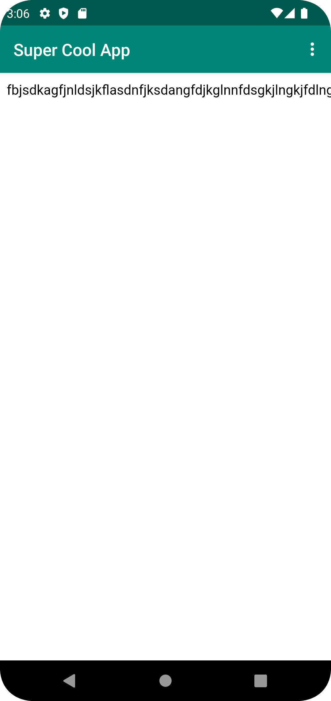
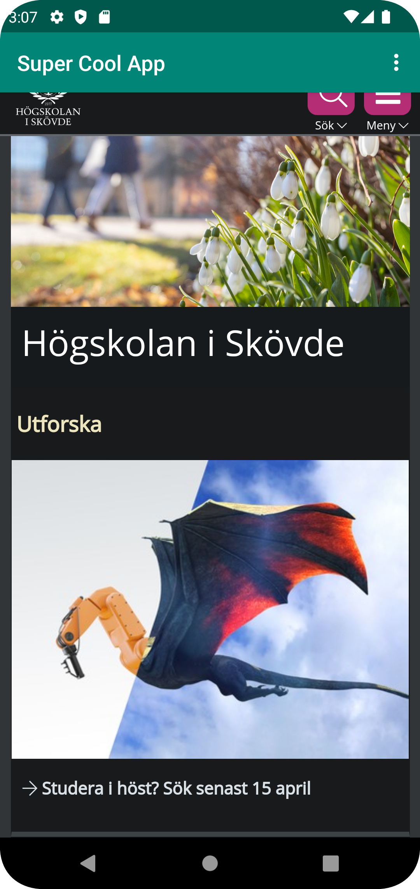

# Rapport

**Skriv din rapport här!**

Bytte namn på appen i strings.xml
```
<string name="app_name">Super Cool App</string>
```

Enabled internet-access i AndroidManifest.xml
```
<uses-permission android:name="android.permission.INTERNET" />
```

Bytte TextView i activity_main.xml och gav den ett ID
```
    <WebView
        android:id="@+id/webView"
        android:layout_width="match_parent"
        android:layout_height="match_parent"
        />
```

Skapade en privat Webview-variabel

```
    private WebView myWebView;
```

Skapade en ny webViewClient, lade till en html-page och länkade till den, samt his.se;
gjorde så att showInternalWebPage och showExternalWebpage kallades och att hemsidorna visades.

```
        myWebView = findViewById(R.id.webView);
        myWebView.setWebViewClient(new WebViewClient()); // Do not open in Chrome!
        myWebView.getSettings().setJavaScriptEnabled(true);
        
         if (id == R.id.action_external_web) {
            Log.d("==>","Will display external web page");
            showExternalWebPage();
            return true;
        }

        if (id == R.id.action_internal_web) {
            Log.d("==>","Will display internal web page");
            showInternalWebPage();
            return true;
        }
```


